# CS2 Bot Improver Assistant

中文名：CS2人机增强助手

这是一个面向 Counter-Strike 2 的桌面助手，用于安装、检查和配置 CS2 Bot 增强相关资源。它不是上游插件本体，而是一个基于 Vue 3、Tauri 2 和 Rust 的安装配置工具。

## 功能

- 选择并检查 CS2 游戏目录。
- 安装内置 Bot 增强资源包，并在写入前检查 CS2 是否正在运行。
- 切换 Bot 难度和在线 / Bot 模式。
- 查看并复制常用 CS2 控制台指令。
- 编辑 BotTaunt AI API、嘲讽文本和 NadeSystem 恢复时间。
- 查找最近录制的 Demo，复制路径或打开所在文件夹。
- 通过 Steam 协议 `steam://rungameid/730` 打开 CS2。
- 从远端更新接口读取普通、推荐和强制更新提示。

## 截图

下面截图覆盖安装检查、游戏设置、常用指令、启动弹窗、更新提示和辅助工具等主要界面。

| | |
|---|---|
| 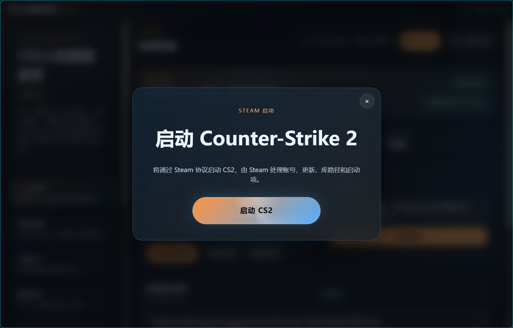 | 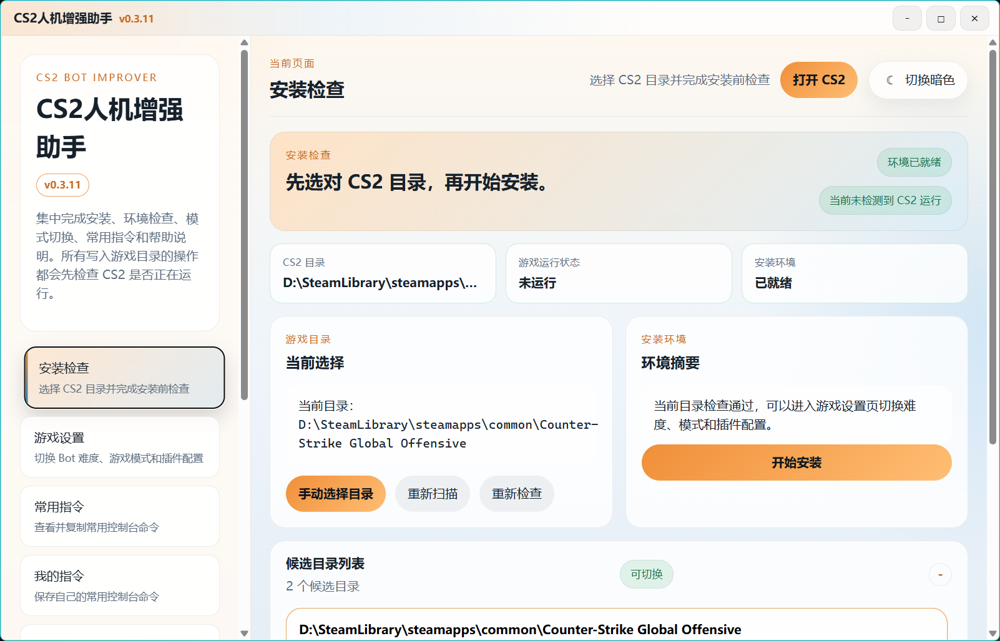 |
|  | 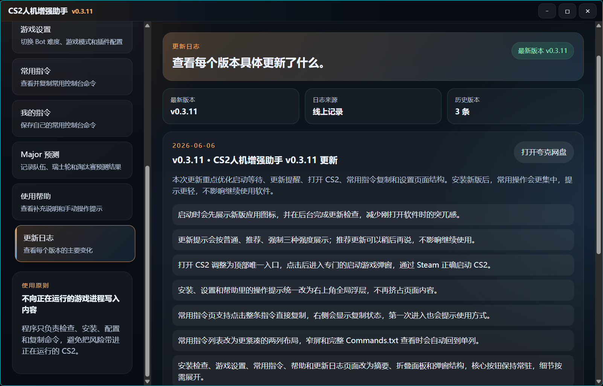 |
| 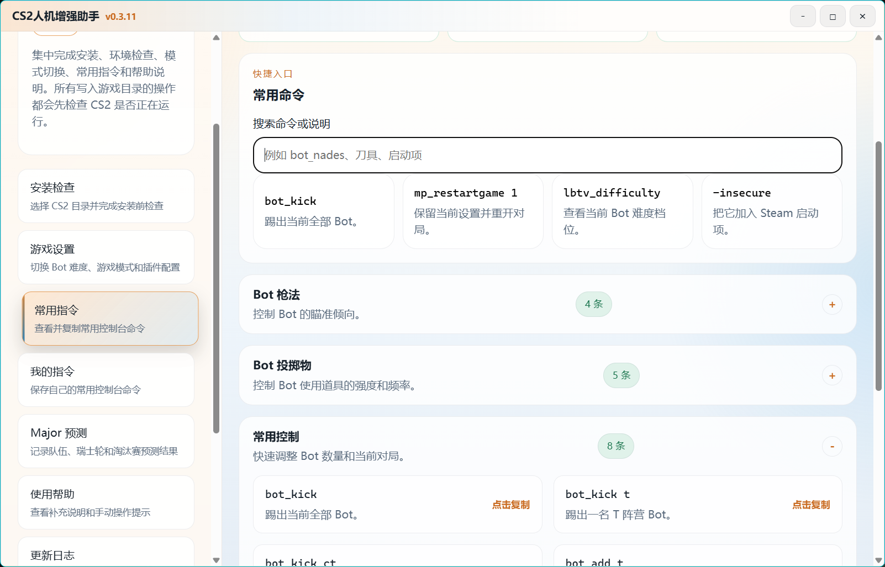 | 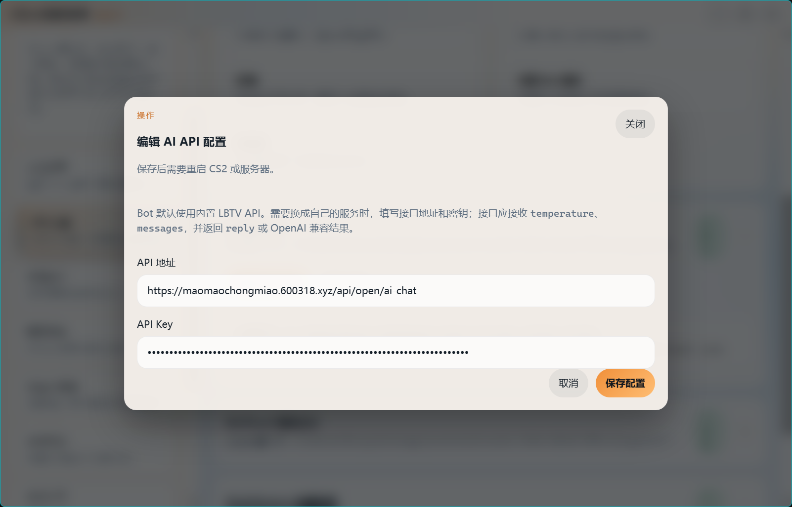 |
| 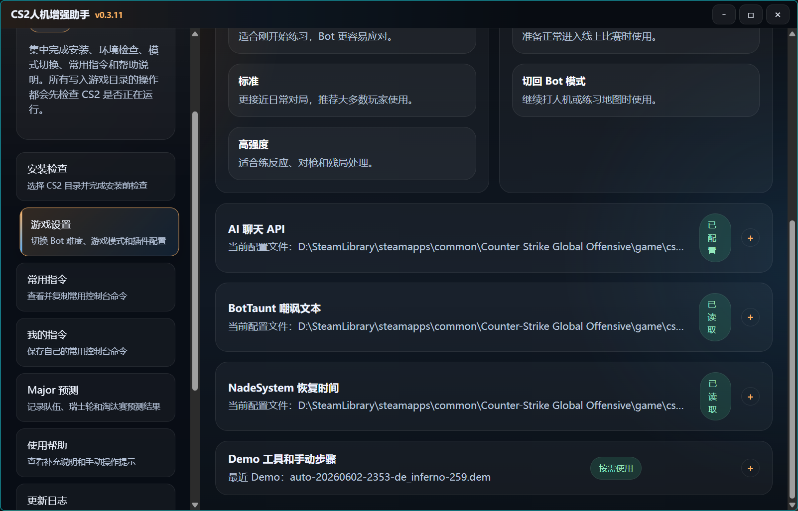 | 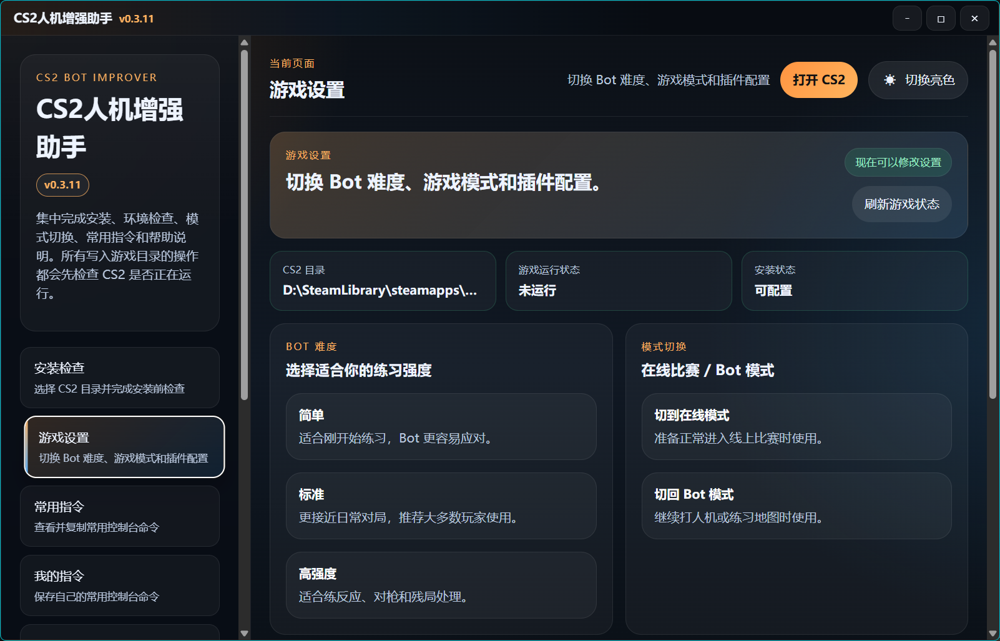 |
| 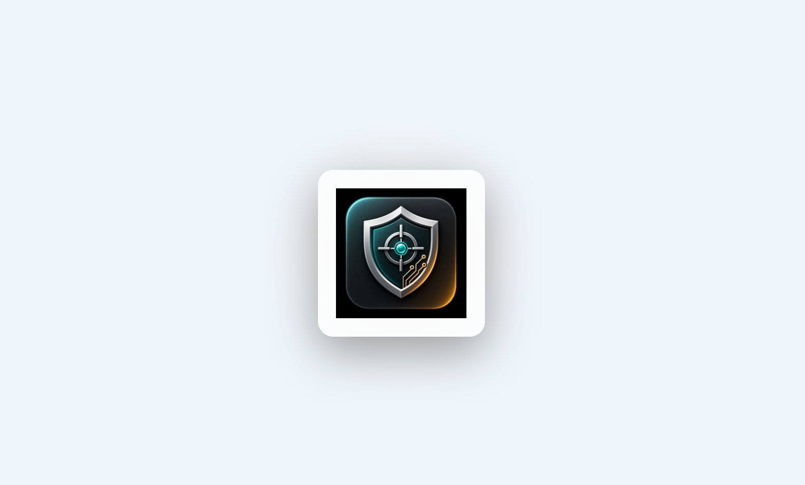 | 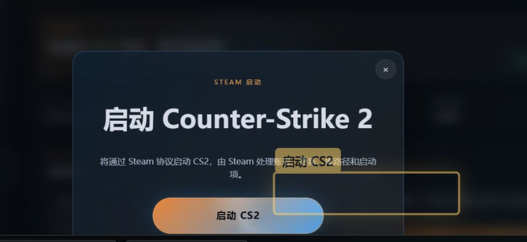 |
| 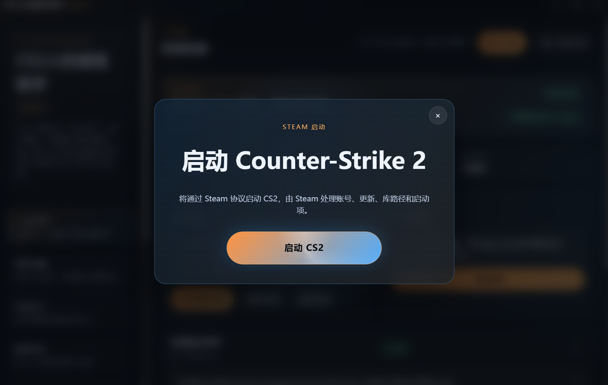 | 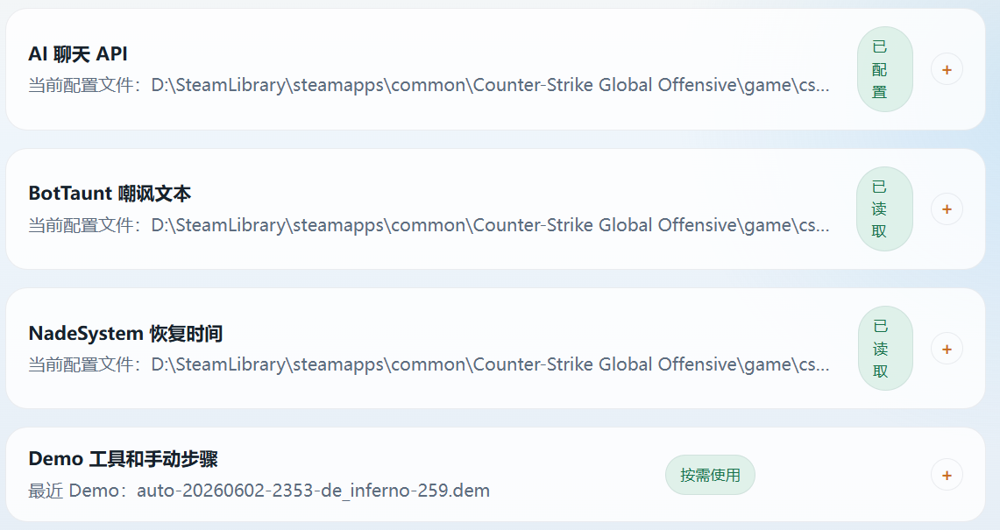 |
| 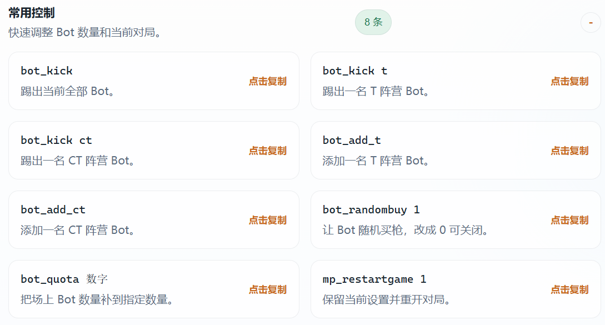 | |

## 下载安装

普通用户建议从 GitHub Releases 下载最新安装包。

源码仓库不建议直接提交 NSIS 安装包、旧安装包缓存、WebView2 固定运行时或插件资源备份。这些文件应该放在 Release assets 中。

## 开发环境

需要：

- Node.js `^20.19.0` 或 `>=22.12.0`
- npm
- Rust 和 Cargo
- Tauri 2 所需的 Windows 构建环境

安装依赖：

```sh
npm install
```

启动 Web 调试：

```sh
npm run dev:web
```

启动桌面调试：

```sh
npm run dev:desktop
```

## 本地环境变量

复制 `.env.example` 为 `.env` 后按需调整。

```sh
cp .env.example .env
```

Windows PowerShell：

```powershell
Copy-Item .env.example .env
```

真实 `.env`、`.env.development` 和 `.env.production` 不应提交到公开仓库。

## 资源包说明

桌面打包配置会引用：

```text
src-tauri/resources/CS2BotImprover.zip
```

为了保持源码仓库轻量，这个二进制资源包默认不提交。需要构建桌面安装包时，请从项目 Release assets 或可信来源取得资源包，并放到上述路径。

同理，以下内容不应进入主分支：

- `src-tauri/resources/*.bak*`
- `src-tauri/resources/webview2-fixed/`
- `src-tauri/target/`
- `dist/`
- `dist-release/`
- `output/`
- `video-output/`
- `video-cs2-*/`
- `workspace/runtime/`

如果后续决定把资源包纳入版本管理，建议使用 Git LFS，并明确上游来源和授权边界。

## 常用命令

类型检查：

```sh
npm run typecheck
```

单元测试：

```sh
npm run test
```

工作区配置检查：

```sh
npm run workspace:check
```

Web 生产构建：

```sh
npm run build:web
```

完整验证链：

```sh
npm run verify
```

构建桌面可执行文件：

```sh
npm run build:desktop
```

构建 Windows 安装包：

```sh
npm run bundle:desktop
```

注意：`npm run bundle:desktop` 需要 `src-tauri/resources/CS2BotImprover.zip` 存在。

## 项目结构

```text
config/                         # 工作区项目注册
docs/                           # 项目文档
public/                         # 静态资源
scripts/                        # 校验和发布脚本
src/                            # Vue 前端源码
src/components/                 # 通用组件
src/features/                   # 业务数据和功能模块
src/services/tauri/             # 前端调用 Tauri 命令的入口
src/stores/                     # Pinia 状态
src/views/                      # 页面
src-tauri/                      # Tauri / Rust 桌面层
tests/                          # 测试
workspace/projects/             # 项目源码工作区
```

当前注册项目：

- `cs2-bot-improver`：CS2 Bot 增强安装、配置和命令助手。

## 使用注意

- 在写入 CS2 目录、安装资源包、切换模式或修改配置前，请先退出 CS2。
- Bot 模式通常需要在 Steam 启动项加入 `-insecure`。
- 需要恢复在线比赛环境时，请移除 `-insecure`，并在助手中切回在线模式。
- “打开 CS2”使用 Steam 协议启动，不直接运行 `cs2.exe`。

## 更新发布

推荐流程：

1. 完成代码修改。
2. 运行 `npm run verify`。
3. 确认 `src-tauri/resources/CS2BotImprover.zip` 已准备好。
4. 运行 `npm run bundle:desktop`。
5. 在 GitHub 创建版本 Release，例如 `v0.3.11`。
6. 上传 NSIS 安装包和必要资源包到 Release assets。
7. 如需客户端自动提示更新，在远端更新服务写入对应版本记录。

## 授权

本仓库中的助手源码使用 MIT License，详见 [LICENSE](./LICENSE)。

若 Release 中包含或再分发第三方插件二进制资源，需要单独确认上游项目授权，并在 Release 说明中标注来源和边界。
